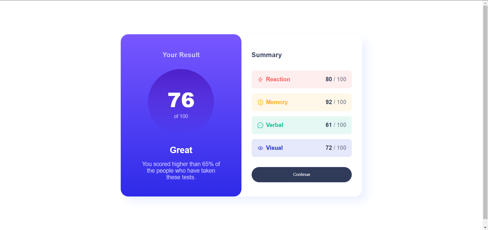

# Frontend Mentor - Results summary component solution

This is a solution to the [Results summary component challenge on Frontend Mentor](https://www.frontendmentor.io/challenges/results-summary-component-CE_K6s0maV).

## Table of contents

- [Overview](#overview)
  - [The challenge](#the-challenge)
  - [Screenshot](#screenshot)
  - [Links](#links)
  - [Built with](#built-with)
  - [Continued development](#continued-development)
  - [Useful resources](#useful-resources)
- [Author](#author)

## Overview

### The challenge

Users should be able to:

- View the optimal layout for the interface depending on their device's screen size
- See hover and focus states for all interactive elements on the page

### Screenshot

### Links

- Solution URL: [Frontend Mentor Solution Link](https://www.frontendmentor.io/solutions/responsive-results-summary-component-I_2J3Mp3XX)
- Live Site URL: [Add live site URL here](https://results-summary-component07.netlify.app/)

### Built with

- Semantic HTML5 markup
- CSS
- SASS
- Flexbox
- Desktop-first workflow

### Continued development

I am not fully confident about the responsiveness of texts and headings on the page right now and am looking forward to update the code ASAP to make the texts and headings more responsive.

### Useful resources

- [Freecodecamp Youtube Tutorial](https://www.youtube.com/watch?v=srvUrASNj0s) - I recently learned responsive web design from the freecodecamp tutorial and it was an amazing learning experience.

## Author
- Frontend Mentor - [@Manan-Bhatia](https://www.frontendmentor.io/profile/Manan-Bhatia)
- Twitter - [@MananBhatia02](https://twitter.com/MananBhatia02)

